# TriageWall Lab threat model

Status: Private Phase 2 UI foundation; not graduated or shipped by default

Scope: the private Lab import, replay, scoring, reporting, and standalone UI
application, with special attention to hostile event-bundle uploads. This
document distinguishes implemented controls from worker and graduation
requirements that remain future work.

## Overview

TriageWall Lab is an isolated local application for comparing a trusted
baseline and candidate against reproducible evidence. It is not a live ingest
service and has no authority to change production. The normal first workflow
is a manually transferred, sanitized event-bundle file, validated in full
before immutable storage, followed by paired calls to a configured local
Ollama endpoint and generation of private results plus a sanitized aggregate
report (`docs/lab-design.md:42-55`, `docs/lab-design.md:73-83`).

Core and Lab are separate services. A graduated Lab must have separate
containers, databases, networks, temporary directories, and persistent
volumes; it must not mount Core state or the Docker socket, and it must not
perform automatic promotion (`docs/core-lab-product-boundary.md:40-55`). The
repository now contains the Phase 0 contracts, a private Phase 1 command-line
runner, and a first standalone authenticated artifact/UI service. The optional
Lab profile remains private incubation and default-off. It does not yet contain
the Core exporter, aggregate report generator, worker job lifecycle,
quota/retention, cancellation/recovery, or audit-history service.

```mermaid
flowchart LR
    A["Attacker-influenced sensor evidence"] --> C["Core exporter\nfuture, operator initiated"]
    C --> F["Hostile bundle file\nmanual transfer"]
    F --> V["Lab staging and v1 validator"]
    V -->|"valid digest-bound object"| B["Immutable Lab bundle store"]
    T["Trusted candidate registry"] --> R["Paired runner"]
    B --> R
    R <-->|"trusted destination, untrusted output"| O["Local Ollama"]
    R --> P["Private paired results"]
    P --> S["Deterministic scorer"]
    S --> E["Sanitized aggregate report"]
    E --> H["Human review and normal Core PR"]
    H -. "never a Lab write" .-> X["Production Core"]
```

### Components and evidence

| Component | Responsibility | Current state and source evidence |
|---|---|---|
| Core exporter | Creates and redacts a bundle only after an explicit operator action | Required by design, not implemented (`docs/event-bundle-v1.md:9-21`) |
| Import byte boundary | Rejects oversized, empty, non-UTF-8, BOM-prefixed, malformed, duplicate-key, and non-finite JSON before contract publication | Implemented validator (`triagewall/event_bundle.py:787-814`) |
| Event-bundle validator | Enforces closed objects, exact version, typed normalized events, evidence bounds, cross-field state, and hashes | Implemented contract (`triagewall/event_bundle.py:198-211`, `triagewall/event_bundle.py:659-771`) |
| Candidate and experiment registry | Keeps model, prompt, policy, and inference authority outside uploaded event data | Authenticated immutable registry enforces exact bundle/candidate bindings before experiment publication (`triagewall/lab/store.py`, `triagewall/lab/app.py`) |
| Runner and Ollama adapter | Runs paired trials using trusted candidate settings and treats model output as untrusted | Private CLI implemented with reference binding, randomized order, model-digest preflight, private endpoint allowlist, no redirects, total per-call deadlines, strict response validation, and canary redaction (`triagewall/lab_runner.py`, `scripts/run_lab_experiment.py`) |
| Private evidence store | Retains immutable bundles and bounded per-pair results | Digest-named no-replace bundle/contract storage plus runner result-manifest/count/reference/result-set verification implemented; quotas, retention, cancellation, and recovery deferred (`triagewall/lab/store.py`, `scripts/run_lab_experiment.py`) |
| Authenticated Lab UI | Keeps private evidence behind a separate local operator boundary | Required PBKDF2 access key, signed bounded session, strict cookie, mutation header, host checks, security headers, and text-only rendering implemented (`triagewall/lab/auth.py`, `triagewall/lab/app.py`, `triagewall/lab/static/lab.js`) |
| Promotion report generator | Produces a sanitized aggregate with derived gate status and no production authority | Contract enforced; generator not implemented (`triagewall/lab_contracts.py:811-885`) |

### Effective resources and capabilities

| Deployment or workflow | Resource or capability | Configuration and precedence | Safe effective value or location | Readers, writers, or recipients | Enforcing control | Evidence or unknowns |
|---|---|---|---|---|---|---|
| Phase 0 validation | Uploaded bytes | Caller supplies bytes; constants define limits | One uncompressed UTF-8 JSON object, at most 64 MiB | Validator only | Size before decode, strict JSON hooks, exact schema/version | Enforced in `triagewall/event_bundle.py:19-28`, `triagewall/event_bundle.py:787-814` |
| Phase 0/1 validation | Embedded projection, asset, options, and Zeek evidence | Values are bundle provenance and evidence, never runtime configuration | Canonical, digest-bound, bounded text or JSON | Validator and private runner | Component byte limits/hashes; runner request options come only from the bound candidate | Enforced in `triagewall/event_bundle.py` and `triagewall/lab_runner.py`; tested with conflicting historical/candidate settings |
| Standalone import | Staging and immutable bundle storage | Lab-owned configured data root only; document IDs never form paths | Digest-named objects in a dedicated Lab volume; never a Core path | Authenticated operator and Lab store | Streamed request cap, complete validation, same-directory atomic no-replace publication, configured storage quota, and bounded terminal retention | Implemented in `triagewall/lab/app.py`, `triagewall/lab/store.py`, and `triagewall/lab/worker.py` |
| Private CLI execution | Candidate, prompt, inference settings, and model identity | Operator supplies separately validated trusted files; upload has no precedence | Candidate values exactly bound by experiment digest | Runner and configured Ollama | Reference/difference binding, candidate-only options, model name/digest preflight | Implemented in `triagewall/lab_runner.py`; authenticated registry deferred |
| Private CLI execution | Ollama destination | Trusted command-line option only | Loopback, RFC1918, or ULA literal endpoint; no redirects | Runner and local Ollama | Destination allowlist, redirect rejection, model binding, per-call total deadline | Implemented in `triagewall/lab_runner.py` and mock adapter tests |
| Private CLI reporting | Private paired evidence | Runner-owned immutable no-replace writes | Explicit Lab-marked private directory; no Core path is selected from a document | Operator and scorer | Per-result/content digests, atomic publication, completion manifest | Implemented first slice; access control, quota, retention, cancellation, and recovery deferred |
| Future reporting | Shareable promotion report | Derived only from complete private results | Sanitized aggregate without event IDs or raw evidence | Human reviewer, PR, or release record | Closed report schema, aggregate result-set digest, derived status, no-authority flag | Envelope enforced in `docs/lab-contracts-v1.md:89-121`; generator/export path is unimplemented |
| Standalone UI | Private artifacts and operator session | Required Lab-only credentials; loopback published by default | Dedicated Lab volume, port, network, process, session cookie, and temporary filesystem | Authenticated operator only | No unauthenticated data reads, strict cookie, mutation header, CSP/frame/host controls, non-root read-only container | Implemented in `triagewall/lab/app.py`, `Dockerfile.lab`, and the explicit `lab` Compose profile; deployment-mode tests remain required |
| Every workflow | Production Core state | No Lab configuration may add access | No Core database, logs, inventory, checkpoints, config volume, or Docker socket | No Lab component | Lab profile has its own volume/network and no production-write API | Compose boundary is implemented; Core-only, Lab-only, and combined deployment proof remains required (`docs/core-lab-product-boundary.md:40-52`) |

## Threat model, trust boundaries, and assumptions

### Protected assets

- Confidentiality of private alerts, IP addresses, asset snapshots, operator
  feedback, model responses, prompts, labels, and full per-event results.
- Integrity and reproducibility of bundles, candidates, experiments, paired
  outcomes, scores, promotion gates, and the exact model/settings used.
- Availability of Lab CPU, memory, disk, GPU/model capacity, worker slots, and
  local storage.
- Isolation of Core databases, sensor logs, inventories, checkpoints,
  configuration, Docker control, and operational verdicts.
- Model endpoint and filesystem destination authority, which must remain trusted
  Lab configuration rather than uploaded data.
- Human release authority. An `eligible` report is evidence, never permission to
  merge, deploy, tune, roll back, or mutate Core.

### Actors and realistic capabilities

**Network or endpoint adversary.** Can cause crafted traffic or activity to
appear in Suricata or Wazuh evidence and may therefore control signatures,
descriptions, URLs, hostnames, payload-like strings, and other evidence carried
into a later sanitized bundle. They do not initially control the trusted Lab
operator, candidate registry, Lab host, model endpoint configuration, or Core
deployment.

**Bundle-origin adversary.** Can supply, replace, truncate, or modify a file
presented to the manual import workflow. They can choose every byte of that
file, including internally consistent hashes, because v1 hashes are integrity
checks and not signatures (`docs/event-bundle-v1.md:102-110`). Successful import
must not grant filesystem, network, model, prompt, policy, or execution
authority.

**Local model.** Receives deliberately selected bounded evidence and may return
malformed, adversarial, canary-disclosing, hallucinated, or excessively slow
output. It is a component under evaluation, not a trusted policy or security
boundary.

**Trusted operator and administrator.** May install candidates, configure the
single local model destination, start experiments, view private evidence, and
export reports. Compromise of the Lab host or trusted administrator is outside
this model, but accidental unsafe configuration must still fail closed.

**Report reader.** May receive a shareable aggregate report but is not thereby
authorized to view private per-event evidence or operate Lab/Core.

### Trust boundaries and objectives

1. **File bytes to validated bundle.** Reject before publication on encoding,
   syntax, version, shape, type, bound, canonical embedded JSON, identity,
   cross-field, or digest failure. Do not perform archive extraction or follow
   a path supplied by the document. Implemented contract checks are evidenced
   at `triagewall/event_bundle.py:305-358` and
   `triagewall/event_bundle.py:659-814`.
2. **Validated evidence to trusted configuration.** Evidence may contain text
   resembling a path, URL, prompt, command, model, or option, but it remains
   data. The v1 top-level object is closed, and candidate selection is a
   separate trusted contract (`docs/event-bundle-v1.md:129-146`,
   `docs/lab-contracts-v1.md:9-19`).
3. **Bundle claims to experiment facts.** Recompute properties that can be
   derived from normalized fields, including Zeek eligibility; enforce matched,
   ambiguous, and disabled state invariants rather than trusting labels
   (`triagewall/event_bundle.py:412-456`,
   `triagewall/event_bundle.py:609-637`). Treat redaction-policy names and
   internally consistent provenance as claims, not authenticated origin.
4. **Candidate registry to runner.** Bind the exact candidate and baseline
   identifiers/digests, model digest, prompt components, revisions, inference
   settings, bundle digest, event selection, and randomized order for the full
   run. Uploaded historical options never become executable settings. The
   private runner enforces this for prompt/model experiments. The authenticated
   UI queues only an exact installed experiment digest; the separate worker
   revalidates all referenced artifacts and the model identity before use.
5. **Runner to Ollama.** Send only the selected bounded projection and evidence
   condition to one trusted configured destination. Reject redirects and apply
   connect/read/total deadlines. Treat responses as untrusted, bounded, and
   schema-validated; replace any live canary disclosure before persistence.
   The private adapter implements these controls for loopback and literal
   private endpoints.
6. **Runner to private storage.** Publish only complete immutable objects using
   transaction and content identity. A failed or canceled call cannot be
   counted as a completed valid pair, and partial runs cannot become eligible.
7. **Private evidence to aggregate report.** Do not export raw events, prompts,
   asset/Zeek records, model responses, reasoning, event IDs, or per-result
   digests. Derive promotion status from complete result counts and all gates;
   always preserve `does_not_authorize_production=true`
   (`docs/lab-contracts-v1.md:89-112`).
8. **Lab to Core.** There is no production-state mount, write credential,
   Docker socket, automatic promotion path, or network capability that can
   mutate Core. Promotion remains a reviewed Core pull request and human
   deployment (`docs/lab-design.md:313-327`).

### Assumptions, exclusions, and open questions

- Lab is local, single-operator software. It binds to loopback by default and
  now requires authentication for every private API. Optional LAN exposure
  still requires a protected tunnel or TLS deployment review.
- The host, trusted Lab configuration, and operator-installed candidates are
  trusted. A compromised host or malicious administrator already holds the
  protected authority and is outside this model.
- Persistent Lab storage, API/UI authentication, initial container hardening,
  single-worker lifecycle, queue/cancellation, lease recovery, quota/retention,
  and aggregate report generation now exist. Core export, a complete audit
  ledger, richer telemetry, and deployment-mode proof remain incomplete. The
  service remains incubation code, not a graduated release.
- V1 accepts only one uncompressed JSON document. Archive extraction,
  compression, multipart uploads, URLs, and directory imports are out of scope
  and must continue to fail closed.
- The validator proves internal consistency, not that Core created the file or
  that its redaction claims are truthful. Authentic origin may require a future
  operator workflow, signature, or authenticated handoff; it must not be
  inferred from SHA-256 alone.
- Redaction transformations are enumerated and cross-checked, but free-text
  evidence can repeat private values. The future exporter needs field-aware
  redaction tests and an operator preview before real bundles leave Core.
- The first local authentication/session mechanism, storage paths, worker
  limits, paired-boundary cancellation, and separate UI/model networks are
  implemented. Optional-LAN TLS/proxy guidance and deployment proof remain open.
- Architecture review was performed sequentially because this task did not
  authorize sub-agent delegation; it was not an independent second review.

## Attack surface, mitigations, and attacker stories

The scenarios below are hypotheses and implementation requirements, not
validated vulnerabilities in a shipped Lab runtime.

| Priority | Scenario and capability gain | Prerequisites | Impact | Existing controls | Required mitigation | Evidence |
|---|---|---|---|---|---|---|
| Critical | Uploaded content reaches a Core mount, Docker socket, production write API, or automatic promotion path | Future Lab is deployed with prohibited mounts, credentials, or network access | Production verdict/configuration mutation or host control | Product boundary forbids all such authority | Deployment tests must prove absence in Core-only, Lab-only, and combined modes; no promotion credentials in Lab | `docs/core-lab-product-boundary.md:40-55`, `docs/lab-design.md:313-327` |
| High | A path-like ID, symlink, archive member, or document field selects a file outside Lab staging/storage | Future importer derives paths from uploads or enables archives | Read/overwrite private or production files | V1 is one non-archive document; identifiers use a safe alphabet; unknown fields fail closed | Open an operator-selected regular file safely, stage in a private directory, reject symlinks/special files, derive storage names from validated digests, keep archives unsupported | `docs/event-bundle-v1.md:23-40`, `triagewall/event_bundle.py:30-32`, `triagewall/event_bundle.py:233-237` |
| High | Oversized/deep input, excessive events, repetitions, concurrent runs, or slow model responses exhaust memory, disk, GPU, or worker capacity | Attacker can present uploads or an operator starts adversarial experiments | Lab outage; interference with co-located services | Input/response limits, exact result ceiling, four-job queue, one worker, per-call deadlines, cooperative cancellation, storage quota, and bounded retention exist | Measure real runs, add host-level CPU/memory limits and a full-run deadline before graduation | `triagewall/event_bundle.py`, `triagewall/lab_contracts.py`, `triagewall/lab/worker.py` |
| High | Uploaded host, URL, model, prompt, or inference options pivot the runner to an attacker destination or executable configuration | Runner mistakenly consumes provenance/evidence as settings | SSRF/private-network access, model substitution, arbitrary workload, credential leakage | Closed bundle schema; candidate contract is separate; private CLI binds candidate-only options, literal private destination, and installed model digest | Keep executable settings in authenticated Lab configuration when the standalone service is added; retain the CLI boundary tests | `docs/event-bundle-v1.md:17-21`, `triagewall/lab_runner.py`, `tests/test_lab_runner.py` |
| High | Sensor evidence performs prompt injection, leaks the canary, changes source boundaries, or induces unsupported Zeek claims | Crafted evidence reaches a model condition | False verdicts, misleading evidence claims, or secret disclosure | Evidence is explicitly untrusted; candidate requires one canary placeholder; result contract records safety signals | Preserve structural prompt isolation, fresh per-call/process canary, bounded complete response validation, deterministic fact allowlists, no-Zeek negative controls, injection corpus, blocking gates | `docs/lab-contracts-v1.md:37-45`, `triagewall/lab_contracts.py:650-660`, `docs/lab-design.md:193-208` |
| High | Tampered or replayed files/results are accepted under the wrong identity or mixed across experiments | Mutable storage, incomplete reference binding, or TOCTOU after validation | Falsified evaluation and unsafe promotion evidence | Canonical component/document digests and immutable reference envelopes exist | Copy validated bytes into private staging, revalidate the staged bytes, publish transactionally by digest, enforce uniqueness, bind every result to experiment/bundle/candidate/runner digests | `triagewall/event_bundle.py:190-195`, `triagewall/event_bundle.py:735-770`, `triagewall/lab_contracts.py:665-700` |
| High | A report marks an incomplete or unsafe experiment eligible, or a consumer treats eligibility as deployment authority | Generator miscounts/omits gates or integration adds self-promotion | Unsafe Core change based on false evidence | Report requires all 13 gates, derives status, and requires a no-authority flag | Generate only from the private result transaction, verify aggregate result-set digest/count, keep normal PR/CI/review/deploy gates, never provision Core write authority | `triagewall/lab_contracts.py:846-884`, `docs/lab-design.md:313-327` |
| Medium | A forged bundle makes internally consistent but false provenance, redaction, labels, or allowed-fact claims | Adversary can replace/create the manual file | Misleading evaluation or private-data exposure | Hashes detect mutation relative to the document but are not signatures; derivable eligibility is recomputed | Treat origin/labels as claims, show provenance to operator, optionally authenticate exporter/handoff, require reviewer attribution for labels, preview redaction | `docs/event-bundle-v1.md:102-110`, `triagewall/event_bundle.py:609-637` |
| Medium | Private event data, prompts, responses, or per-result fingerprints leak through logs, errors, metrics, UI, or exported report | Importer/runner/reporting logs or serializes raw values | Disclosure of network and asset information | Private CLI prints only bounded status/path data; sanitized promotion-report schema excludes raw/per-result data | Add sentinel-leak tests for aggregate reports, authenticated views, metrics, and future logs; keep response bodies out of diagnostics | `scripts/run_lab_experiment.py`, `docs/lab-contracts-v1.md:89-121` |
| Medium | LAN user imports bundles, reads private results, starts costly runs, or exports reports without authorization | Operator exposes Lab beyond loopback | Confidentiality loss and resource abuse | UI requires a configured PBKDF2 access key, login throttling, revocable signed strict session, mutation header, exact confirmation, queue/result bounds, and loopback binding by default | Add deployment-reviewed TLS/proxy guidance, scoped credentials if roles expand, and a complete audit ledger | `triagewall/lab/auth.py`, `triagewall/lab/app.py`, `docker-compose.yml` |
| Medium | Ollama traffic is observed or modified, or a redirect crosses the configured boundary | Model endpoint is not loopback/private protected transport | Evidence disclosure or manipulated output | CLI restricts the endpoint to loopback or a literal private address, rejects redirects, verifies the installed digest, and binds the response model | Prefer loopback; require protected transport/authentication before relying on a nonlocal private endpoint | `triagewall/lab_runner.py`; adapter boundary tests in `tests/test_lab_runner.py` |
| Low | Duplicate IDs, contradictory lookup state, mismatched counts, type confusion, or noncanonical embedded JSON creates ambiguous interpretation | Malformed hostile file reaches validator | Incorrect correlation or divergent implementations | Strict types, closed objects, canonical embedded JSON, unique event IDs, cross-field checks | Keep the reference validator normative, maintain cross-implementation fixtures, and run the hostile matrix in CI | `triagewall/event_bundle.py:202-211`, `triagewall/event_bundle.py:305-358`, `triagewall/event_bundle.py:730-764` |

The executable cases and deferred runtime obligations are tracked in
[Lab hostile-upload matrix](lab-hostile-upload-matrix.md).

## Severity calibration

**Critical.** A Lab import or report path can directly obtain host/Docker
control or mutate production Core without a separate trusted human action.
This requires a concrete prohibited capability such as a Core write credential,
Core volume, Docker socket, or automatic promotion endpoint. A hostile bundle
that only fails validation is not Critical.

**High.** A normal hostile file or attacker-influenced evidence can escape Lab
storage, cause arbitrary network/model selection, persistently falsify promotion
evidence, disclose secrets/canaries, or reliably exhaust shared Lab/host
resources without already controlling the trusted operator. Loopback-only
deployment, strict quotas, or a required malicious administrator may lower the
practical severity.

**Medium.** Exploitation requires optional LAN exposure, a nonlocal unprotected
model transport, an operator importing a forged file, or another meaningful
deployment prerequisite, and results in private-evidence disclosure, bounded
resource abuse, or misleading but still human-reviewed evaluation. Missing
implementation evidence is an open question, not proof of a Medium issue.

**Low.** A malformed bundle causes a bounded rejection, safe diagnostic, or
self-only failed experiment without crossing an authority or confidentiality
boundary. Parser disagreement that cannot reach storage, execution, or reports
also remains Low until a concrete capability gain is shown.

Model misclassification by itself is expected product risk, not automatically a
security vulnerability. It becomes security-relevant when a boundary failure
lets untrusted evidence escape its role, bypass a hard safety gate, disclose a
secret, or gain production authority.

Repository: uncommitted private Lab working tree; refresh before review
Version: pending Codex Security snapshot refresh
